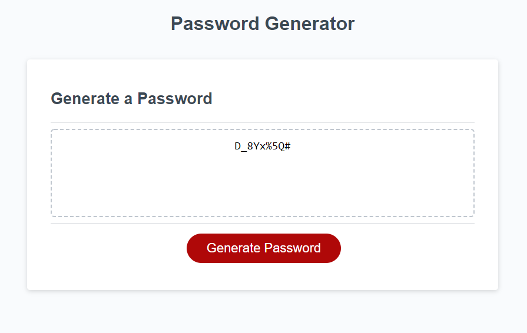

# Password Generator

## Description
The purpose of this application is to generate a secure password by prompting the user to enter values based on the given criteria.

## Deployed Application
https://am-cowles.github.io/Password-Generator/index.html

## User Story

```
AS AN employee with access to sensitive data
I WANT to randomly generate a password that meets certain criteria
SO THAT I can create a strong password that provides greater security
```

## Screenshot

The following image shows the web application's appearance and functionality:

